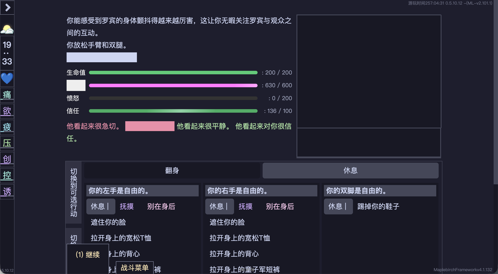
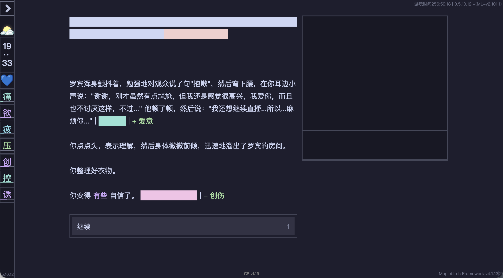
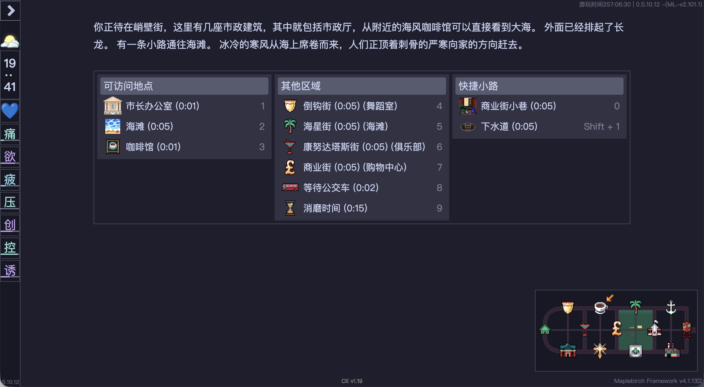
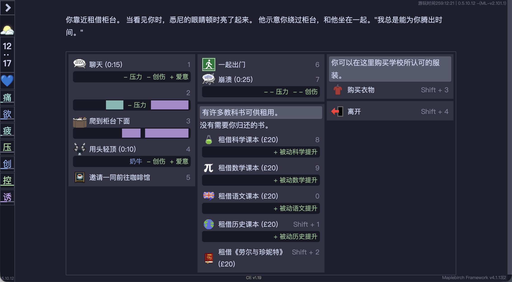
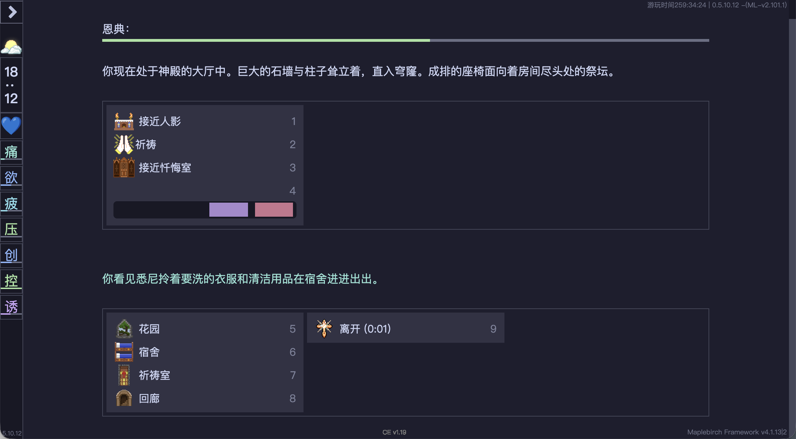

# DoL Compact UI
一个致力于让 UI 在宽屏布局下更紧凑美观的 Degrees of Lewdity 模组。

## 基本要求
- Degrees of Lewdity 本体：>= 0.5.10.12（旧版本未测试）
- modLoader 模组管理器：>= 2.0

本 mod 完全建立在对渲染后 UI 的调整，理论上说拥有很强的 mod 兼容性，如果遇到特殊页面渲染异常，欢迎 issue 反馈。

## 调整明细
本 mod 主要针对宽屏的布局进行了调整，但是同样兼容手机等窄屏布局，如果遇到窄屏布局自适应异常的问题欢迎 issue 反馈。
### 战斗页面紧凑布局

将战斗画面移到了顶部，并将战斗选项表格化便于选择。

### 列表菜单紧凑布局

列表菜单改为横向的多列布局，节省垂直空间减少反复的滚动操作。
地图板块悬浮固定在右下角方便直接查看。

## 这个页面可以改改吗？
如果你有什么想调整的页面、什么也没有问题，欢迎提出 issue，最好带上存档（不然要找到某个页面还是很费劲的）。

## 感谢
（这也有感谢吗）
- [Combat UI Rework](https://github.com/LeafGithub/D4Mods-Releases) - 灵感来源